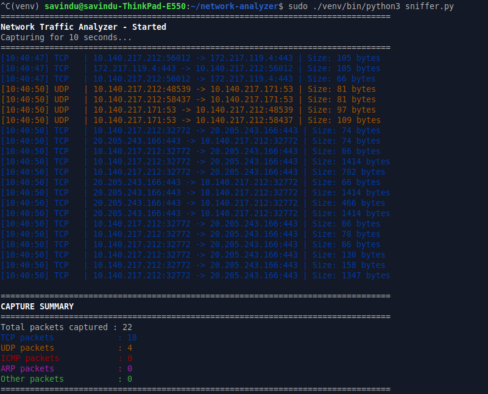
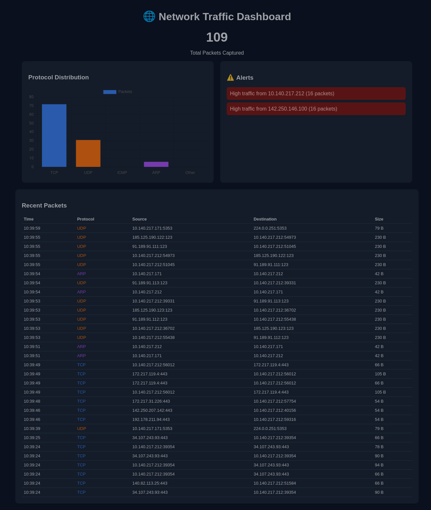
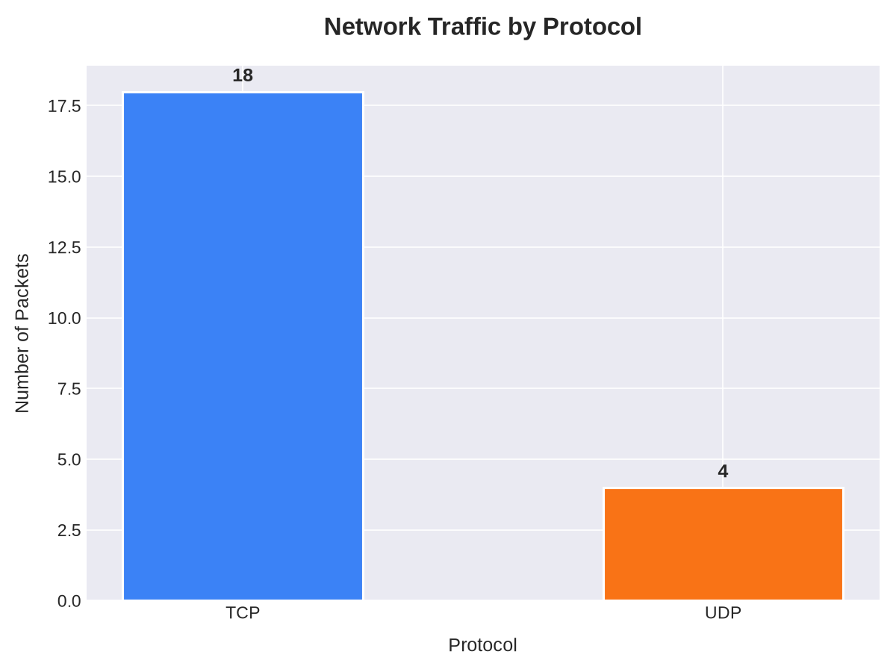

# Network Traffic Analyzer

A real-time network packet sniffer and traffic analyzer built with Python and Scapy. Captures live network traffic, classifies it by protocol (TCP, UDP, ICMP, ARP), detects suspicious activity, and visualizes results through both a terminal interface and a live web dashboard.

## Features

- **Real-time packet capture** using Scapy
- **Multi-protocol support**: TCP, UDP, ICMP, ARP
- **Colored terminal output** for easy protocol identification
- **Suspicious activity detection** — flags IPs sending abnormally high traffic (possible scans/floods)
- **Live web dashboard** built with Flask + Chart.js — view traffic stats and recent packets in real time from a browser
- **CSV export** of captured packet data for further analysis
- **Auto-generated bar chart** (Matplotlib) summarizing protocol distribution

## Tech Stack

- Python 3
- Scapy (packet capture)
- Flask (web dashboard backend)
- Chart.js (frontend visualization)
- Matplotlib (static chart generation)
- Colorama (terminal coloring)

## Screenshots






## How to Run

### 1. Clone the repository
```bash
git clone <your-repo-url>
cd network-analyzer
```

### 2. Set up a virtual environment
```bash
python3 -m venv venv
source venv/bin/activate
```

### 3. Install dependencies
```bash
pip install -r requirements.txt
```

### 4. Run the terminal-based analyzer
```bash
sudo venv/bin/python3 sniffer.py
```

### 5. Or run the live web dashboard
```bash
sudo venv/bin/python3 app.py
```
Then open `http://localhost:5000` in your browser.

**Note:** Root/sudo privileges are required for packet capturing on most systems.

## How It Works

The tool uses Scapy to sniff packets directly from the network interface. Each captured packet is inspected to determine its protocol and extract key details (source/destination IP, ports, size). A simple heuristic tracks packet counts per source IP to flag potential port scans or traffic floods. Data is displayed live in the terminal and/or a Flask-powered web dashboard, and can be exported to CSV for offline analysis.

## Future Improvements

- DNS query-specific tracking
- PDF report generation
- Configurable capture duration and interface via command-line arguments
